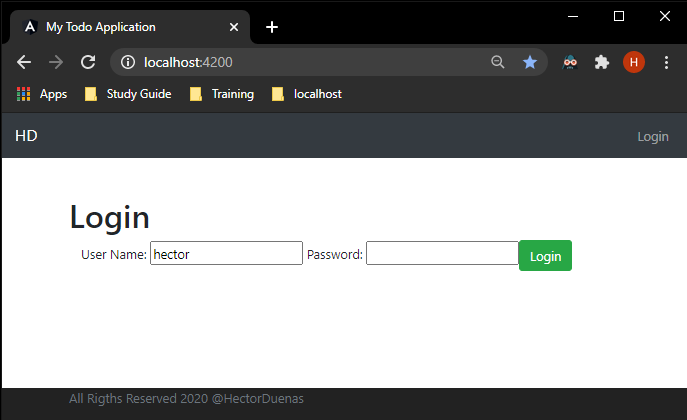
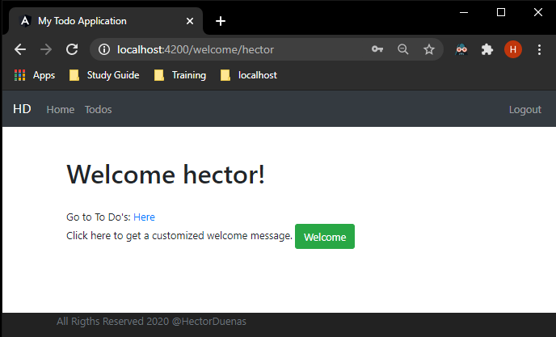
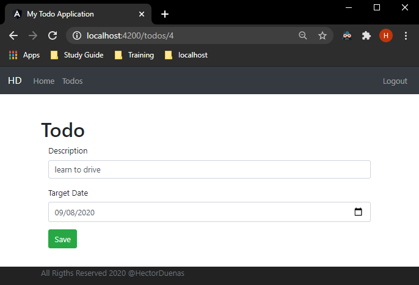
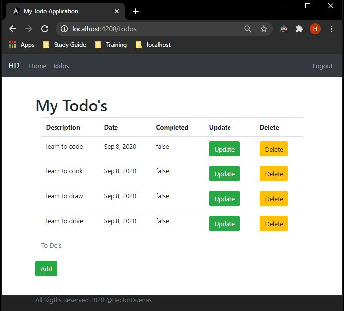
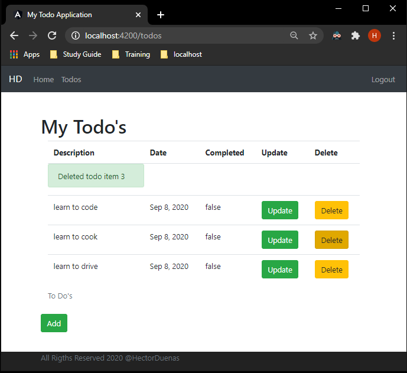
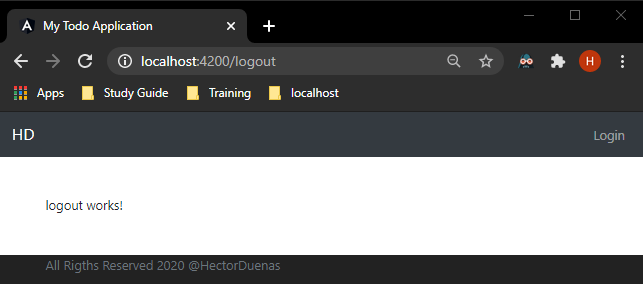

# To-Do-Web-Application
To Do Web Application built using Spring and Angular.

### Login
User logs into the application.                                       

### Welcome
After logging in the user is directed to the welcome page.

### To-Do-List
User is able to go view the list of To Do's.          

### Add To-Do
The user is able to add a new To Do to their list.

### Delete To-Do
If a user is done with an item, they are able to delete it from the list.

### Logout
Once the user is done, they are able to logout of the application.

