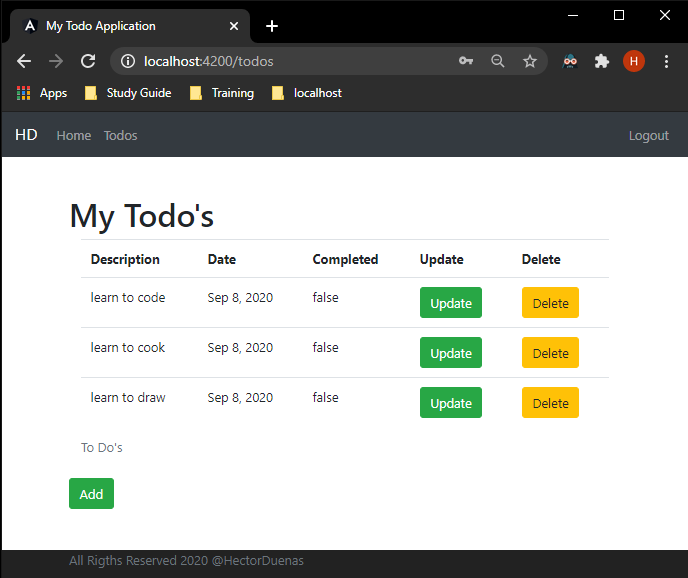

# To-Do-Web-Application
To Do Web Application built using Spring and Angular.

User logs into the application.

After logging in the user is directed to the welcome page.

User is able to go view the list of To Do's.

The user is able to add a new To Do to their list.

If a user is done with an item, they are able to delete it from the list.

Once the user is done, they are able to logout of the application.

